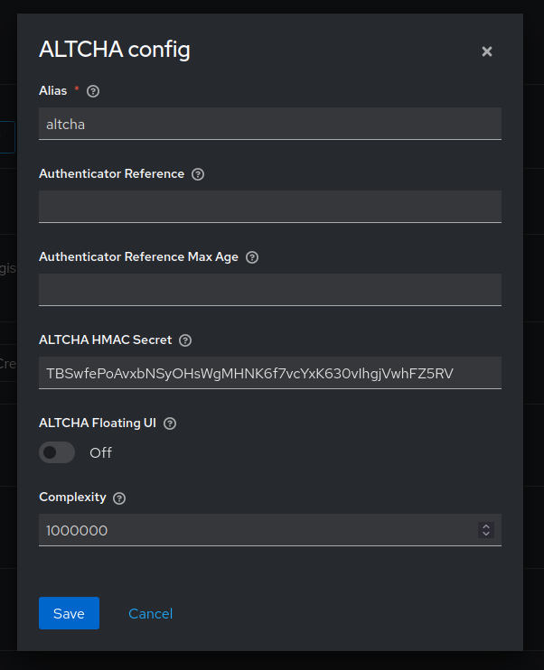

# keycloak-altcha

To safeguard registration against bots, Keycloak has integration with Google reCAPTCHA. This extension provides similar functionality, but with a more privacy friendly provider named [ALTCHA](https://altcha.org/). The code is based [the hCaptcha extension](https://github.com/p08dev/keycloak-hcaptcha), itself based on the vanilla implementation of reCAPTCHA in Keycloak.

ALTCHA is a proof-of-work captcha generator which generates a complex math challenge taking a few seconds for a computer to solve, thus hindering exploitation of the form by spambots. The CAPTCHA doesn’t need any user interaction and is therefore accessible for disabled people.

This implementation doesn’t make **any third-party call** whatsoever. The Keycloak extension is using [the server-side Java implementation](https://github.com/altcha-org/altcha-lib-java) of ALTCHA and generates the challenge by itself. A small [Javascript snippet](https://github.com/altcha-org/altcha) is needed to solve the challenge client-side.

## Installation

Download the latest JAR from the Releases section of **[our Gitea repository](https://git.lacontrevoie.fr/lacontrevoie/keycloak-altcha/releases)** or compile the JAR, then drop it into `your_keycloak_installation/providers`.

### Registration flow

There are a few steps you need to perform in the Keycloak Admin Console.

1. Click the **Authentication** left menu item and go to the **Flows** tab.
2. Search for the flow named **Registration**, click on the options dropdown at the right and click on **Duplicate**. Give it whatever name you want.
3. Click on the flow to see its steps.


4. On the parent step named `<flow name> registration form`, click the « + » icon and select **Add step**.
5. Select **ALTCHA** in the list and click **Add**.
6. Set the **ALTCHA** step requirement from Disabled to **Required**.
7. Click the gear icon at the right of the ALTCHA step, then fill the following information:
- Give it a name (`altcha` is fine)
- In the **ALTCHA HMAC Secret** field, write a random string (the longer, the better). This key will be used to sign and verify captcha challenges.
- In the **Complexity** field, use a value comprised between 100 000 and 1 500 000 rounds. Write it without spaces and ensure that the chosen integer is positive. See [ALTCHA docs](https://altcha.org/docs/complexity/) for more details.

Here’s a valid configuration example:



### Theme configuration

Now, you need to make changes on your current theme or create a new theme. Please refer to [the Keycloak documentation](https://www.keycloak.org/docs/latest/server_development/#_themes) to create or edit your own theme.

You will need to edit the [login/register.ftl](https://github.com/keycloak/keycloak/blob/main/themes/src/main/resources/theme/keycloak.v2/login/register.ftl) template file and add the following lines after the `<@registerCommons.termsAcceptance/>` if block:

```html
<#if altchaRequired??>
    <altcha-widget challengejson='${altchaPayload}' <#if altchaFloating?? && altchaFloating=="true">floating</#if> hidefooter delay="2000" auto="onload" expire="3600000"></altcha-widget>
</#if>
```

You can customize the widget settings following [the documentation](https://altcha.org/docs/website-integration/). Beware that you cannot edit the `expire` setting yet (see #1).

Then, drop [the minified JS file](https://eu.altcha.org/js/latest/altcha.min.js) into the `login/resources/js/` folder.

Create a new file in the `js/` folder named `altcha-import.js`, containing the following:

```js
import("./altcha.min.js")
```

In the `theme.properties` file, add `js/altcha-import.js` into the `scripts=` setting. Do not add the minified JS file in the list: as a module, it needs to be imported by the intermediate file you created.

### Final steps

1. In the **Authentication** left menu item, **Flows tab**, click on the options dropdown of your custom registration flow and click on **Bind flow**.
2. Finally, enable registration : go to **Realm settings**, **Login** tab, and toggle **User registration** on.

And that’s it!

## Compiling it yourself

Clone the repository:

```bash
git clone https://github.com/p08dev/keycloak-hcaptcha.git
```

Inside the repository, compile it using Maven with Java 17:

```bash
mvn clean compile package
```

You can instruct Maven to use a specific Java version by prepending the JAVA_HOME environment variable:

```bash
JAVA_HOME=/usr/lib/jvm/java-17-openjdk/  mvn clean compile package
```
You will get two JAR files in the `target/` folder. The one you’re looking for is `keycloak-altcha-jar-with-dependencies.jar`.

## Maintenance

This project is maintained by [La Contre-Voie](https://lacontrevoie.fr/) for internal use and is meant to be shared with anyone who needs it.

We need money to pay people to maintain this project, among others. If you are using this work and can afford it, [please consider donating](https://lacontrevoie.fr/#faire-un-don).

## License

[MIT](LICENSE)
